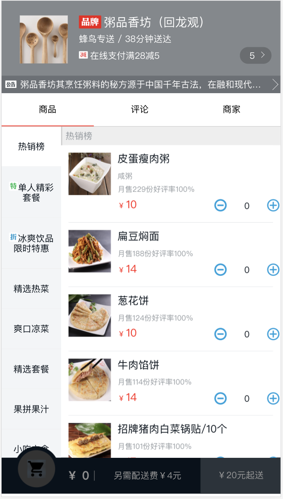
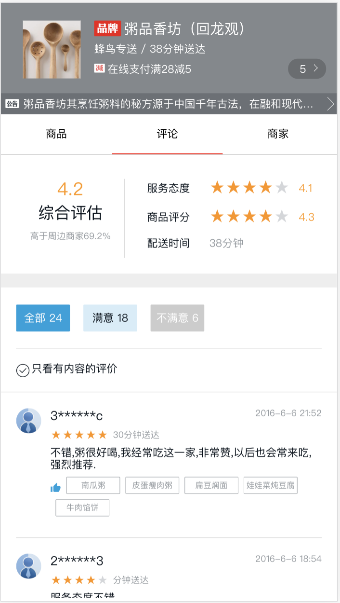
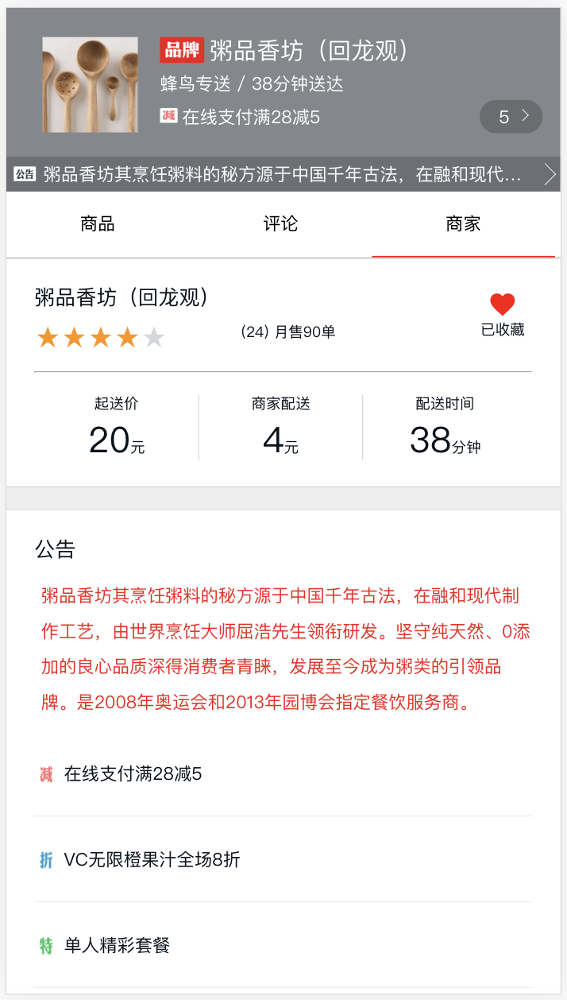
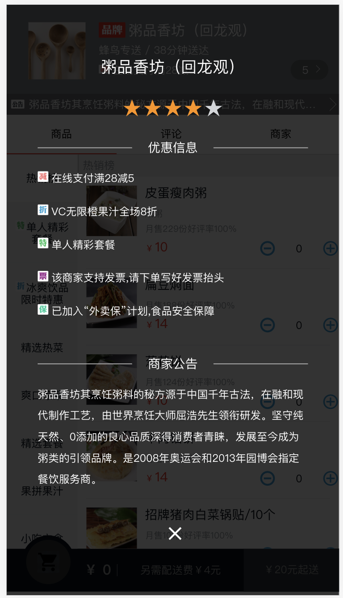
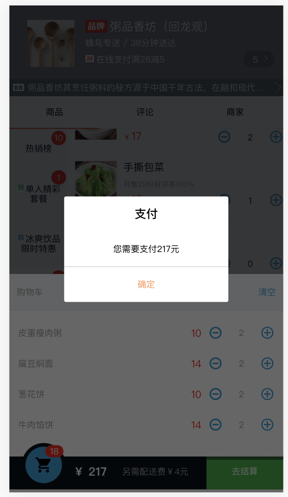
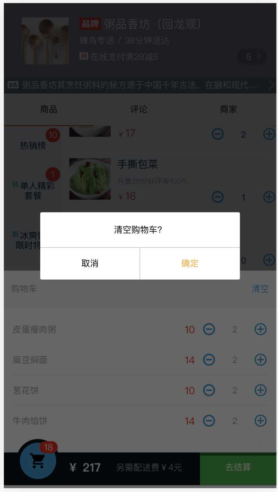

# vue-elm-mall

## 线上预览

[http://123.56.124.33:5000/](http://123.56.124.33:5000/)

## 安装依赖

```
npm install
```

### 开启一个具有热重载功能的开发服务器

```
npm run serve
```

### 构建项目

```
npm run build
```

## 项目截图








